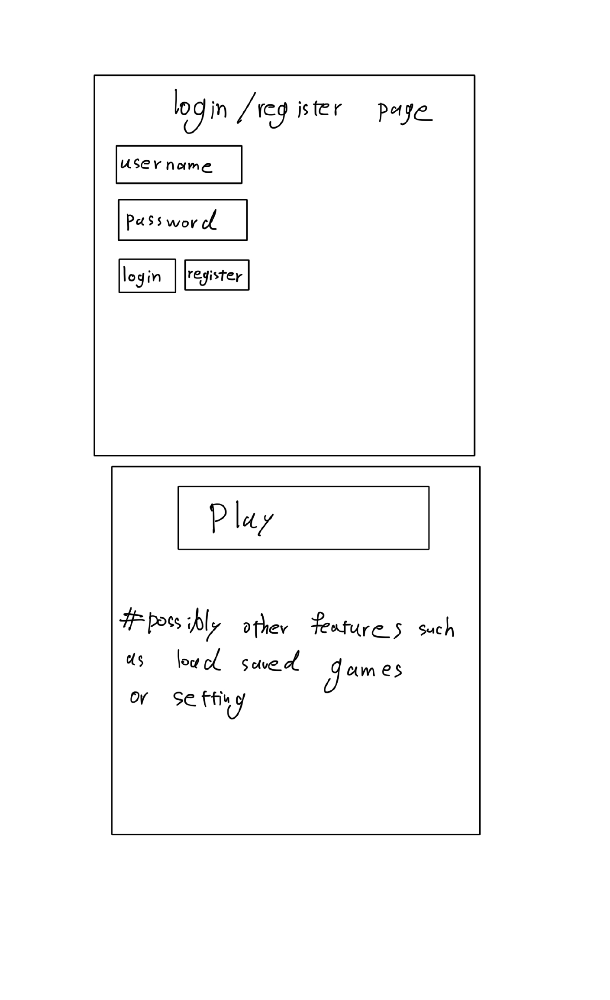

# Project Proposal

## Description

This project aims to create a stock trading game as a web application, offering a realistic simulation of stock market trading. From the perspective of the player, the game provides an engaging environment to practice trading strategies, buy and sell stocks at real-time NYSE prices, and compete with others to achieve the highest portfolio value. For the admin, the application offers tools to manage the game, including registering players, setting game durations, and monitoring overall progress. This blend of gameplay and management ensures an immersive experience for all users, fostering both competitive and educational aspects of stock trading.

## Screens

### Login, Registration, and Game Initialization

- **Login and Registration Screen**: This screen allows users to either log in to their existing account or register for a new one. The registration process is straightforward, requiring basic information such as username, password, and email. (Almost certainly it will have RegEx)

- **Game Initialization Screen**: Once logged in, players can initiate a new game or join existing ones. Admins have the option to create new games, set durations, and configure starting parameters.

### Main Game Interface

- **Player Interface**: Shows the player's current assets, net worth, and available stocks for trading. It is designed to mimic real-life trading environments with functionalities to buy and sell stocks, view portfolio changes, and analyze stock performance.

- **AI Players and Competitors**: Displays AI and other competitors' net worth, potentially clickable for an expanded view to reveal trading history and strategy insights.

- **Trading Pages**: Dedicated pages for executing buy and sell orders, equipped with real-time price fetching and transaction confirmation alerts to enhance the trading experience.

## Features

| ID  | Name                                   | Access By | Short Description                                                               | Expected Implementation       | Source of Idea      |
|-----|----------------------------------------|-----------|---------------------------------------------------------------------------------|-------------------------------|---------------------|
| 01  | Player Registration                    | Player    | Players register for a specific game                                            | Must implement                | Project description |
| 02  | Login                                  | Player    | Players log in to access their account                                          | Must implement                | Project description |
| 03  | Game Duration                          | Admin     | Configure start/end of each game                                                | Admin will do                 | Project description |
| 04  | Set Daily Transaction Limit            | Admin     | Limit the number of transactions a player can make in a day                     | Must do                       | Project description |
| 05  | Set Transaction Fee Formula            | Admin     | Admins set a formula for transaction fees                                        | Admin will do                 | Project description |
| 06  | Moving Average                         | Player    | An added feature to candlestick charts showing moving average                    | Probably not                  | Project description |
| 07  | Clickable AI Players - History         | Player    | Click on AI players to view their transaction history                            | Maybe implement               | Project description |
| 08  | Clickable AI Players - Holdings        | Player    | Click on AI players to see the exact stocks they hold                            | Maybe                         | Project description |
| 09  | Instant Price Fetch                    | Player    | Question mark button near stock buy/sell box to fetch and show price immediately | Probably will do              | My own idea         |
| 10  | Auto-Skip Day on Limit                 | System    | Skip day automatically if daily transaction limit is reached                     | Will implement                | My own idea         |
| 11  | Daily Net Worth Reset                  | System    | Net worth shown resets each day                                                  | Must do                       | My own idea         |
| 12  | Net Worth Change History and Graph     | Player    | Show a player's net worth change history and graph                               | Maybe                         | My own idea         |
| 13  | Skip Remaining Transactions            | Player    | Players can skip remaining transactions and end their day                        | Will implement                | My own idea         |
| 14  | Leaderboard                            | All       | Display a leaderboard of players based on net worth                              | Extension                     | My own idea         |
| 15  | Real-time Market Data Integration      | System    | Integrate real-time market data for trading                                      | Extension                     | My own idea         |
| 16  | Customizable Portfolio Dashboard      | Player    | Allow players to customize their portfolio view                                  | Extension                     | My own idea         |
| 17  | Real-time News Feed                    | Player    | Show real-time news feed that could affect stock prices                          | Extension                     | My own idea         |
| 18  | Chat Room for Players                  | Player    | A chat room for players to discuss strategies                                    | Extension                     | My own idea         |
| 19  | Trade Confirmation Alerts              | Player    | Send alerts for trade confirmations                                              | Extension                     | My own idea         |
| 20  | Game Creation Wizard for Admins        | Admin     | A step-by-step wizard for admins to create games                                 | Extension                     | My own idea         |
| 21  | Player Trading History                 | Player    | Show a history of all trades made by a player                                    | Extension                     | My own idea         |
| 22  | Automated Trading Options              | Player    | Allow players to set up automated trading strategies                             | Extension                     | My own idea         |
| 23  | Mobile Responsive Design               | All       | Ensure the web application is responsive on mobile devices                       | Extension                     | chat GPT        |
| 24  | Player Profile Customization           | Player    | Allow players to customize their profiles                                        | Extension                     | My own idea         |
| 25  | Advanced Stock Filtering Options       | Player    | Advanced filtering options for stocks                                            | Extension                     | chat GPT         |
| 26  | Multi-game Participation               | Player    | Allow players to participate in multiple games simultaneously                    | Extension                     | chat GPT         |
| 27  | In-game Achievements and Badges        | Player    | Introduce achievements and badges for reaching milestones                        | Extension                     | chat GPT         |
| 28  | Admin Dashboard for Monitoring         | Admin     | A dashboard for admins to monitor game progress and player activities            | Extension                     | chat GPT         |
| 29  | Feedback System for Game Improvements | All       | A system for players and admins to provide feedback for game improvement         | Extension                     | chat GPT        |
| 30  | Historical Data Analysis               | Player    | Allow players to analyze historical stock data for better decision-making       | Extension                     | chat GPT            |

## Implementation

### Tools and Packages

- **Express.js**: A web application framework for Node.js, designed for building web applications and APIs. It's known for its performance and minimalistic structure.
- **MongoDB**: A NoSQL database for storing player data, game records, and transaction histories. It pairs well with Express for backend development.
- **React**: A JavaScript library for building user interfaces. Use this for creating dynamic and responsive front-end designs.
- **Socket.IO**: For real-time bidirectional event-based communication. Useful for implementing the chat room and real-time updates for stock prices and player actions. (not sure)

### App API

1. **POST /register**
   - Registers a new player in the game.
   - Body: `{ username: string, password: string, email: string }`
   - Response: `{ success: boolean, playerId: string }`

2. **POST /login**
   - Authenticates a player and returns a session token.
   - Body: `{ username: string, password: string }`
   - Response: `{ success: boolean, token: string }`

3. **GET /game/status**
   - Fetches the current status of the game, including active players and leaderboard.
   - Response: `{ gameStatus: string, players: Array, leaderboard: Array }`

4. **POST /trade/buy**
   - Submits a request to buy stocks.
   - Body: `{ playerId: string, stockSymbol: string, quantity: number }`
   - Response: `{ success: boolean, newPortfolio: Object }`

5. **POST /trade/sell**
   - Submits a request to sell stocks.
   - Body: `{ playerId: string, stockSymbol: string, quantity: number }`
   - Response: `{ success: boolean, newPortfolio: Object }`

These resources and API calls are foundational to creating a robust back-end

### Stock API

To integrate real-time stock market data into our application, we'll utilize the Alpha Vantage API. This service provides up-to-date stock quotes and financial information, essential for executing buy and sell orders based on current NYSE prices. An example API call to retrieve the latest stock price is as follows:

- **GET /query?function=TIME_SERIES_INTRADAY&symbol=IBM&interval=5min&apikey=YOUR_API_KEY**
  
This call fetches intraday time series data for IBM, providing high, low, open, close prices, and volume numbers across a 5-minute interval. Such data will be pivotal for our game's trading mechanism, ensuring players have access to accurate and timely market information.
